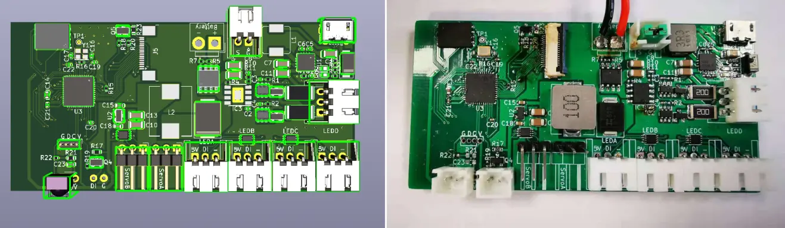
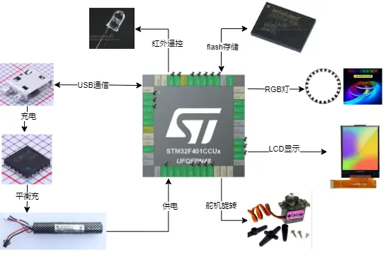
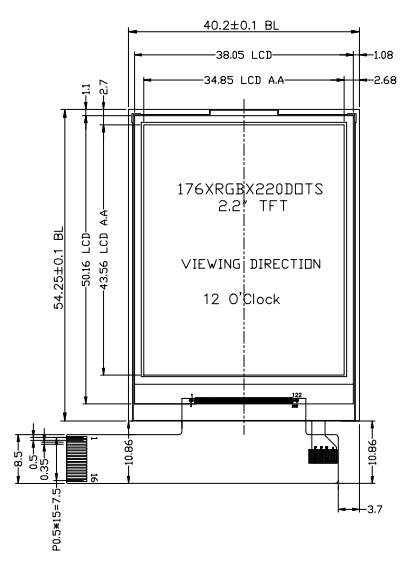
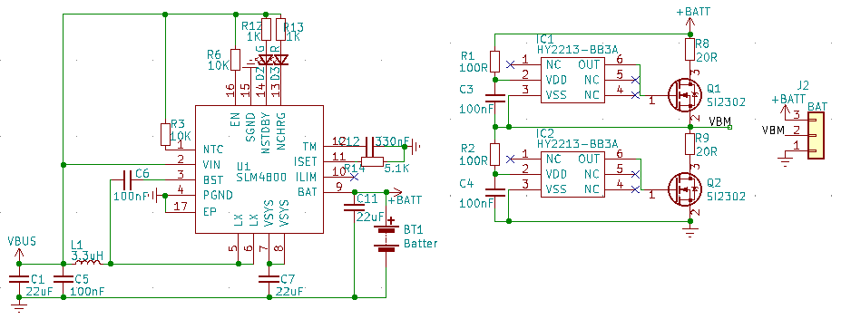
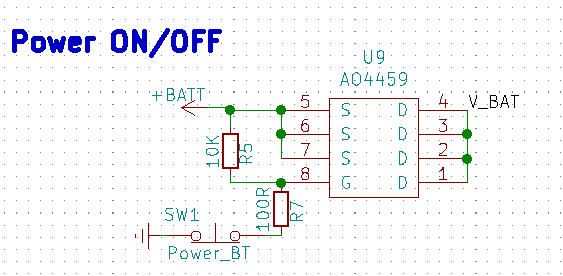
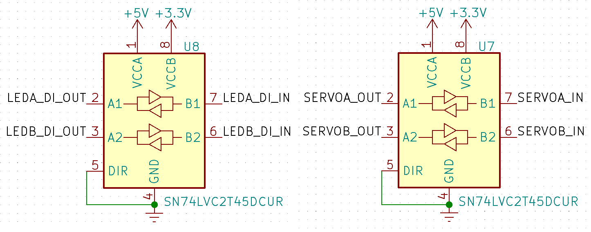
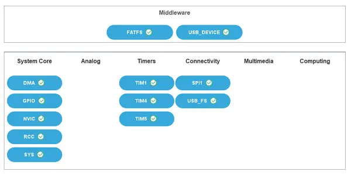
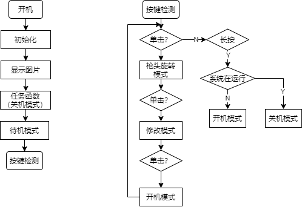

# 文档信息

|     |     | 
| --- | --- | 
|  姓名  |  LonlyPan  | 
|  职位  |  嵌入式工程师   | 
|  项目时间   | 2021/01/01 - 2021/05/10 | 
|  2021/05/10 第一版  |    | 
|  2020/xx/xx 第二版  |    | 

___


# 简介

该套设备是配套灵笼光影探测仪使用，模仿动漫中的功能，实现屏幕显示，红外发射修改胸牌显示内容，灯光显示以及相关动作。
B站视频：[【灵笼】私造荷光者专属武器，我看你是活腻了！](https://www.bilibili.com/video/BV1FK411F7UJ)

## 功能

- 模拟动画内容，实现RGB灯关显示，屏幕显示、枪头旋转、可发射红外线修改身份牌信息
- 采用锂电池供电、可充电。

## 关键技术

- LCD 8位并口驱动显示
- 红外发射
- 舵机驱动
- WS2812 灯带驱动
- 双节锂电池充放电

## 难点

- 双节锂电池充放电
- WS2812 灯带驱动

## ToDo

- 屏幕驱动修改为SPI，节省外设资源和布线
- WS2812 灯带驱动优化（改为非阻塞驱动）
 
 

 ___
# 约定

## 常用缩写及含义

```
@file              文件名
@author            作者
@brief             简要说明
@details           实现细节
@param             用于函数说明中，后面接参数名字，然后再接关于该参数的说明
@return            返回值综述
@retval            返回值列举并说明
@note              注解信息
@attention         注意信息
@warning           警告信息
@see               表示交叉参考
@ToDo              计划实现的Marlin程序讲解1/34
```

## +、-号

变量和函数前的
- “+” 号表示公有成员
- “-” 号表示私有成员

例如：
`+bool enqueue(&item)`：表示方法 `enqueue(&item) `为公有成员，对外公开
`-enabled_globally`：表示变量 `enabled_globally` 为私有成员，只可在所在文件内访问

___
# 1、Alpha版
技术选型和验证阶段，方案未确立阶段

## 1.1 硬件设计 

详细资料请阅读PCB设计文件。
BOM表中也列出了各元件的购买渠道。



### 方案选择

#### 充电
2串、多串锂电池充电及平衡一直以来都是一件麻烦的事情。 有用高电压直接充不管平衡的，也有用独立充电器串联后充的。都是比较麻烦的做法。

SLM6800 是一颗可以直接5V输入，升压给2串锂电池充电的芯片。内置mos，可以有效减少外部器件和成本。

增加HY2213平衡芯片。可以充2串锂电池的时候给与最大限度的电压平衡（电池本身需要配对）。

带简单的均衡电路。**对于体制差别不大的新电池。如果有轻微的不平衡可以使用。如果是严重不平衡不管啥高级均衡都够呛。**

一般来说，HY2213只是应对轻微不均衡的情况，然后在充放电过程中自动将其均衡，防止累积造成更大的不均衡。如果我们的电池组中两节电池电压相差高达1V，那么HY2213也是无能为力的。


经过实际测试，可以正常使用，但需要先将两块电池单独充满，防止电压差别较大，导致平衡充失败。

**参考方案：**

 - [双节锂电池平衡充电模块](https://oshwhub.com/jixin/7_4V-dccf6b6eb48e4ba995b01585fd50890f)
 - [SLM6800-5V输入双串锂电池平衡充电器](https://oshwhub.com/zhqsoft/SLM6800)

#### LCD显示屏

根据尺寸要求，选择 2.2寸 显示屏。


#### 主控
采用常用、已有芯片STM32F401CCU6。无其它特殊技术要求。

#### flash
实际使用128M容量的，但64M即满足使用，两者仅驱动程序上需改。

### 电路设计

电路设计部分均参考元件资料中的参考设计。


#### 两串锂电池平衡充电路

基本参考官方资料和上面参考设计。R8、R9时放电电阻，需要散热，电路设计的时候注意一下。HY2213-BB3A监测每节电池的电压，当其超过4.2V后，就开启一个放电回路即Q1或Q2，以减少此节电池的充电电流。具体放电电流可以通过电阻自定义。

当HY2213开启平衡放电后，电池还是可以有一些电流进行充电的。当然这个时候充电电流也不能过大，不然也可能会产生过充的情况。当电池组整体充电完毕后（比如4节电池串联总电压达到16.8V），电压高于4.2V的电池，还会继续进行均衡放电的。



#### 电源开关

起初设计是电源的通断是由水平开关控制的，所以选择了该方案，后来改为手动控制开关，但实际使用时，开关是常闭的。外壳设计上也并未设计电源开关。



#### 电平转换电路

舵机和WS2812均是5V电路，STM32引脚未3 .3V，所以需要电平转换。




## 1.2 软件设计

### 文件结构说明

- cc.h 自定义一些数据类型供其它库文件使用
- Comheader.h 最基础的公共头文件包含及公共声明定义，基本每个源文件都要包含该头文件
- delay.c/h 延时函数
- lcd_font.h  常用 ASCII 字符表，用于LCD显示
- lcd.c/h lcd底层驱动（初始话、发送命令等）,lcd一些简单画图功能函数
- led.c/h  RGB灯驱动
- Mymain.c/h 主程序
- remoter.c/h 红外接收驱动
- servo.c/h 舵机驱动
- task .c/h 功能函数，对应探测仪实际操作
- text.c/h 汉字显示
- w25qxx.c/h W25QXX驱动代码
- ws2812.c/h 灯带驱动


### 外设资源

 - DMA+TIM5：WS2812灯带驱动
 - TIM1：红外发射
 - TIM4：舵机驱动
 - SPI1：flash驱动
 - USB_FS、FATFS、USB_DEVICE：文件系统，USB通信



### 主要流程

1. 长按开关机
2. 开机之后，系统默认无动作，单击切换动作
3. 开机后，进入开机模式：侧灯和两翼灯点亮
3. 第一次单击：枪头旋转，枪头灯点亮
4. 第二次单击：修改模式，主要是灯光变化，并发射红外信号，修改身份牌显示
5. 第三次单击：回到开机状态
 



### 驱动设计

#### 程序初始化配置

请参考程序源码。

#### WS2812驱动设计

TIM2和TIM5的CCR寄存器都是32位的，所以DMA字节配置上应设置为 world  
DMA传输一半是会调用一次中断函数，一开始直接在中断函数 `DMA1_Stream4_IRQHandler(void)` 关闭 DMA 传输，导致只有一半的灯受控制。需改为在 `HAL_TIM_PWM_PulseFinishedCallback` 关闭DMA 传输。

DMA的同一通道的不同数据流是无法同时使用的。  
不同通道的不同数据流是否可同时使用，未知。  
不同通道的同一数据流是无法同时使用。

### API及函数说明

#### show_flash_name()
- @brief: 显示用户自定义名称或三连图片
- @note: 名称或图片只能同时显示一个。自定义名称来自文件 name.txt，需要用户自己修改，为空则不显示
 
 该功能实际并未使用。
 
#### idle()

- @brief:  基本任务轮询
- @note: 需要持续调用以维持系统基本运行，如函数阻塞则须在阻塞函数中单独调用该函数

#### key_process()

- @brief: 按键处理函数，切换不懂任务状态
- @note: 名称或图片只能同时显示一个。自定义名称来自文件 name.txt，需要用户自己修改，为空则不显示


#### power_on_mode()

- @brief:  开机模式
- @note: 环灯跑马灯效果会持续一段时间，期间任何操作无效

#### wing_turn_mode()

- @brief: 两翼旋转的模式1
- @note: 前灯亮起，舵机旋转

#### wing_turn_next_mode()

- @brief: 两翼旋转的模式2
- @note: 前灯亮起，且跑马灯效果。由 wing_turn_mode() 自动调用

#### modify_mode()

- @brief: 修改模式
- @note: 前灯爆闪，两翼收起且回正


#### LCD_Flash_Pic(u16 x,u16 y,u16 length,u16 width,const char* path)
- @brief 显示flash中的图片
- @param: x,y起点坐标
- @param: length 图片长度
- @param: width  图片宽度
- @param: *path  图片地址

#### IR_Send(u8 data)

- @brief 发送一次红外数据
- @note: 红外发射信息中不仅有发送的数据，还包含引导码、地址码等
- @param {u8} data 要发送的数据

## 参考资料

### 充电电路

 - [双节锂电池平衡充电模块](https://oshwhub.com/jixin/7_4V-dccf6b6eb48e4ba995b01585fd50890f)
 - [SLM6800-5V输入双串锂电池平衡充电器](https://oshwhub.com/zhqsoft/SLM6800)
 - [两节锂电池18650_TYPE-C充电_可调升压最大32v](https://oshwhub.com/HUANNGYIQIAN/liang-jie-li-dian-chi-18650_TYPE)
 - [便宜又好用的锂电池平衡放电芯片HY2213-BB3A](http://club.szlcsc.com/article/details_5732_1_41.html#floor_41)
 - [HY2213中文手册](https://wenku.baidu.com/view/b0c9f91d8762caaedd33d4d8.html)
 - [两个电压不同电池并联](https://www.3rxing.org/question/fbbf17b510766483270.html)
 - [并联两节电池充电和给一节锂电池充电有什么不同](https://e2echina.ti.com/question_answer/analog/battery_management/f/35/t/142069)

### 稳压电路

### 5V
[RT8279电源芯片](http://bbs.eeworld.com.cn/thread-541446-1-1.html)

### 红外

 - [曝光一个产品级的红外发射电路](https://www.sohu.com/a/418185229_744981)
 - [红外收发管参数及硬件设计参考](https://blog.csdn.net/sternlycore/article/details/90052346)
 - [红外遥控编码与解码](https://blog.csdn.net/wuhenyouyuyouyu/article/details/105900088)
 - [基于STM32f103c8t6的红外接收发送](https://blog.csdn.net/qq_45529757/article/details/102737948)
 - [关于开发板上红外遥控解码高低位问题（貌似高低位反了）](http://www.openedv.com/forum.php?mod=viewthread&tid=15643&highlight=%BA%EC%CD%E2%D2%A3%BF%D8%2B%B5%CD%CE%BB)
 - [基于STM32的红外遥控重点解析（网上搜的）](http://www.openedv.com/forum.php?mod=viewthread&tid=233446&highlight=%BA%EC%CD%E2%D2%A3%BF%D8)
 - [\[每日电路图\] 2、红外遥控电路原理设计与解析【转+解读】](https://www.cnblogs.com/zjutlitao/p/5122983.html)
 - [红外遥控实验高位在前还是低位在前呢](http://www.openedv.com/forum.php?mod=viewthread&tid=38938&highlight=%BA%EC%CD%E2%D2%A3%BF%D8%2B%B5%CD%CE%BB)
 - [红外遥控器那个程序，为什么按一次遥控器执行两次程序](http://www.openedv.com/forum.php?mod=viewthread&tid=108090&highlight=%BA%EC%CD%E2%D2%A3%BF%D8)
 - [STM32 红外发射Timer1 ch1 PWM输出](http://www.openedv.com/forum.php?mod=viewthread&tid=23730&highlight=STM32%2B%BA%EC%CD%E2%B7%A2%C9%E4Timer1%2Bch1%2BPWM%CA%E4%B3%F6)
 - [基于STM32f103c8t6的红外接收发送](https://blog.csdn.net/qq_45529757/article/details/102737948)
 - [stm32 红外发射接收](https://bbs.21ic.com/icview-2558620-1-1.html)
 - [STM32红外发送和接收](https://blog.csdn.net/u012616827/article/details/94721668)
 - [STM32——红外接收和红外发射](https://blog.csdn.net/yongliang_huang/article/details/103436227)

### LCD

 - [GigAnon/stm32-commons](https://github.com/GigAnon/stm32-commons)
 - [ZinggJM/TFT_22_ILI9225](https://github.com/ZinggJM/TFT_22_ILI9225)
 
### WS2812

- [STM32/GD32驱动RGB(ws2812)灯带总结](https://www.cnblogs.com/duguqiuying/articles/11389069.html)
- [ws2812 + ws2811 + pwm + dma with stm32cubeide🔥🌈](https://www.youtube.com/watch?v=R2LJP4DIAHQ)
- [STM Урок 119. WS2812B. Лента на умных светодиодах RGB. Часть 2](https://narodstream.ru/stm-urok-119-ws2812b-lenta-na-umnyx-svetodiodax-rgb-chast-2/)
- [STM Урок 119. WS2812B. Лента на умных светодиодах RGB. Часть 3](https://narodstream.ru/stm-urok-119-ws2812b-lenta-na-umnyx-svetodiodax-rgb-chast-3/)
- [STM32(Cortex](https://www.dazhuanlan.com/2019/10/05/5d97ba6c1c673/?__cf_chl_jschl_tk__=e4b2a6a50d2397b3c40df3ec7ca011747a0cb2d7-1614741256-0-ARA6_W25pTXy8sN2lkznDAGjVdzUST3ZNBk258MQ1OeO7vNfyv0elVrcQqYsT8cEpZe6rvvbDvoRU7ss-I7AkeFnGW-f_8OQcD0AgYA-MZdvI8ye95dikeC8Qm8-NfeYnBhEnAV5s5PxqRXd2ly10Qw9BMQQZWM1eLhLr3OpWZEZpOKsgAOHh6Sj7F8IGhmCNIf7vX8gn2ikghjPQEI2131kPAdoYmj8N9pcGE5bCLcAfX6sDOo1u_4azOX_6LJ8qNUHXLj4ACt_bK9M336Wc_mCyx0mf9clXgGUQ-7fLS6AWhQQyjVQz6Dg5KokKC6gnzG6EdYWu1YZi64h9nQBKu0)
[github代码-Cortex-M](https://github.com/jungleeee/Cortex-M/tree/master/Cortex-M4/timer-dma)
- [Tutorial: Control WS2812B leds with STM32](http://stm32f4-discovery.net/2018/06/tutorial-control-ws2812b-leds-stm32/)
- [STM32F1/F7使用HAL库DMA方式输出PWM详解（输出精确数量且可调周期与占空比）](https://blog.csdn.net/qq_30267617/article/details/109466698)
- [STM32F103+HAL+PWM+DMA+WS2812](https://www.geek-share.com/detail/2717222710.html)
- [STM32CUBEMX使用PWM+DMA驱动WS2812](https://blog.csdn.net/Hot_Ant/article/details/107252154)
- [STM32F405 多路PWM_DMA 控制2000+颗SK6812/WS2812探索过程问题记录及解决方案记录 STM32库函数DMA配置过程全解析](https://blog.csdn.net/yx19981001/article/details/102459342)
- [关于STM32 DMA重新使能的话题](http://www.51hei.com/bbs/dpj-57519-1.html)

### Flash

 - [STM32在FATFS文件系统模式下SPI访问SD卡](http://www.mcublog.cn/stm32/2020_04/stm32-fatfs-spi-sd/)
 - [STM32HAL----USB串行FLASH模拟U盘](https://blog.csdn.net/a3748622/article/details/80347730)
 - [让QSPI FLASH(W25Q64)支持Fatfs文件系统](https://chowdera.com/2021/02/20210222040010069c.html)

### 舵机
- [STM32CuBeMX驱动舵机](https://blog.csdn.net/weixin_44403583/article/details/111174169)
- [STM32Cube-21（补充） | 使用通用定时器产生PWM驱动舵机](https://cloud.tencent.com/developer/article/1662813)
 
<!--more-->


